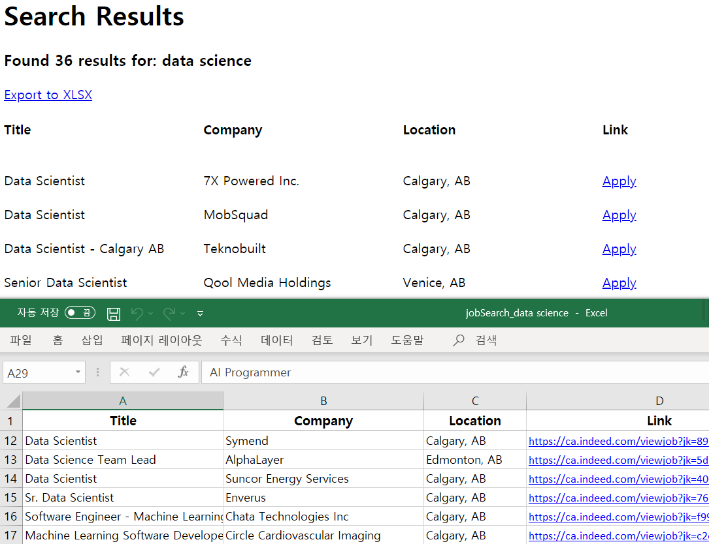

## Job Scraper

### Description
This scrapes job postings from Indeed and/or StackOverflow then writes the result to a CSV file.
<b>EDIT</b>
 
This scrapes job postings in Alberta, Canada from Indeed then display the result right away.
 
 
You can check the result on the browser and download a CSV file.
 
 
The CSV file has 4 columns; title, company, location, and link. 
 
<b>FYI:</b> Indeed removes job postings if the job posting is similar to those already shown. So the number of jobs and actual results can be different on the Indeed page. My program handles only the displayed outputs.
 
 

### Skills
It uses Python, html.