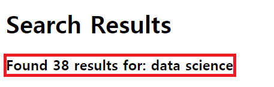

## Job Scraper

### Description
This scrapes job postings in Alberta, Canada from Indeed, then displays results immediately and lets you download it.
  
<b>EDIT (Oct. 25, 2020)</b>
 
📢 CSV file -> XLSX file download 📢
 
The first row of the file is frozen, so this helps increase readability.
 
The XLSX file has 4 columns; title, company, location, and link.
  
✅ Home:
 
  
✅ Results (Oct.25, 2020) and XLSX file:
 
  
<b>⚠ FYI ⚠ </b> Indeed removes job postings if the job posting is similar to those already shown. So the number of jobs and actual results can be different on the Indeed page. My program handles only displayed outputs.
 
✅ Indeed Result (Oct. 24, 2020):
 
 
 
✅ My Program Result (Oct. 24, 2020):
 
  
<b>EDIT (Oct. 24, 2020)</b>
 
This scrapes job postings in Alberta, Canada from Indeed then displays results right away.
 
You can check the results on the browser and download a CSV file.
 
The CSV file has 4 columns; title, company, location, and link.

### Skills
It uses Python, html.